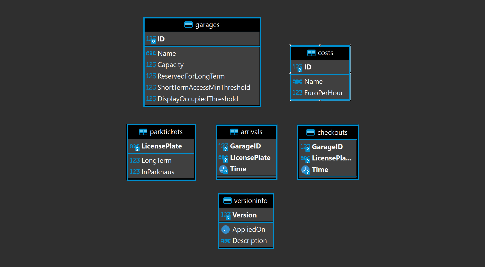

# Title 1


## Subtitle 1


## Subtitle 2


# Title 2


## Lists
- If you press s you can see notes etc
- if you press esc you can see all the slides
- Hello
- Hello World
- Hello World 2
  + subworld
  + subworld 2
  

::: notes

This are example Notes you can write markdown in this

Warning:
 Do not put this in a '# Title' with a '## Title' will cause formatting problems

:::

## Database



::: notes

Add images like this '\!\[caption\]\(path\)'

:::

## Simple Code Example

``` C#

int i = 1;

```

## More complex code example

``` {.csharp data-line-numbers="|4,5,6,7|9-18|11|12-17" data-id="code-animation"}
[Migration(20210602114520, "Create Table Garages")]
public class Migration_20210602114520 : Migration
{
    public override void Down()
    {
        Delete.Table("Garages");
    }

    public override void Up()
    {
        Create.Table("Garages")
            .WithColumn("ID").AsInt32().NotNullable().PrimaryKey()
            .WithColumn("Name").AsString().NotNullable()
            .WithColumn("Capacity").AsInt32().NotNullable()
            .WithColumn("ReservedForLongTerm").AsInt32().NotNullable()
            .WithColumn("ShortTermAccessMinThreshold").AsInt32().NotNullable()
            .WithColumn("DisplayOccupiedThreshold").AsInt32().NotNullable();
    }
}
```

::: notes

Atributes for highlightjs

1. .csharp for the language
2. data-line-numbers="|4,5,6,7|9-18|11|12-17" for highlighting specific lines 
3. data-id="code-animation" that it is an animation

:::


# Math

Cauchy's integral formula

As seen in this equation, duis aute irure dolor in reprehenderit in voluptate velit esse cillum dolore eu fugiat nulla pariatur. Excepteur sint occaecat cupidatat non proident, sunt in culpa qui officia deserunt mollit anim id est laborum.

## sub because else broke
